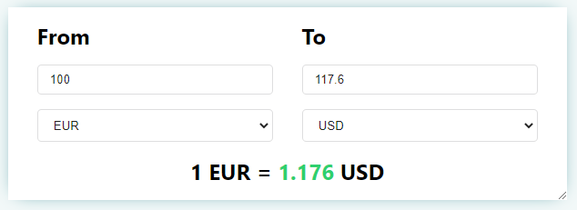

currencyConverter - javascript currency converter
----



## Compatibility
IE9 and up, Edge, iOS Safari 6+, Chrome 8+, Firefox 6+

## Usage

### The currencyConverter Instance

You may store the instance by assigning the result of an invocation to a variable.

Here are a few ways to do it.

```js
const cc = currencyConverter("#myID", {}); // currencyConverter
```

```js
const myElement = document.querySelector(".myElement");
const cc = currencyConverter(myElement, {});  // currencyConverter
```

```js
const instances = currencyConverter(".currencyElm", {});
instances[0] // currencyConverter
```
[Demo](https://shailesh-satariya.github.io/currency-converter/demo/)

#### Props

|Prop name|Description|Default value|Example values|
|----|----|:----:|:----:|
|baseAmount|Default input amount.| `100` |`20`|
|currencyApi|The api which will be used to fetch currency data if `"currencyData"` prop is not set |"https://&#8203;api.exchangeratesapi.io/&#8203;latest"|"https://&#8203;data.fixer.io/api/&#8203;latest"|
|currencyData|Currency values for dropdown. If not provided, it will be fetch through exchangeApi.|n/a|`{ AUD: 1.6376, BGN: 1.9558, BRL: 6.0777}`|
|fromCurrency|Initial from currency value for for dropdown.|`"EUR"`|`"INR"`|
|inputFromAmountClass|Class name(s) that will be added along with `"input-from-amount"` to the from amount `<input>` element.|n/a| `"class1 class2"`|
|inputFromCurrencyClass|Class name(s) that will be added along with `"select-from-curreny"` to the from currency `<select>` element.|n/a| `"class1 class2"`|
|inputToAmountClass|Class name(s) that will be added along with `"input-to-amount"` to the to amount `<input>` element.|n/a| `"class1 class2"`|
|inputToCurrencyClass|Class name(s) that will be added along with `"select-to-curreny"` to the to currency `<select>` element.|n/a| `"class1 class2"`|
|locale|Localization data|n/a|`{ From: 'Von', To: 'Zu'}`|
|onChange|Callback method when data is changed.|n/a|`(data) => console.log(data)`|
|precision|Decimal precision for conversation.|`4`|`2`|
|toCurrency|Initial to currency value for for dropdown.|`"USD"`|`"JPY"`|
|wrapperClass|Class name(s) that will be added along with `"currency-converter"` to the main `<div>` element.| n/a | `"class1 class2"`|
|withText|Whether to show currency text. `"1 EUR = 1.1608 USD"`|`true`| `false` |

#### Methods
##### setAmount(amount)
Sets the input from amount

##### setCurrency(currency)
Sets the select from currency

##### updateCurrencyData(data)
Updates the currency data

#### Events
##### onInit
onInit gets triggered when the component is initialized

##### onChange
onChange gets triggered when currency or amount is changed

##### onDestroy
onDestroy gets triggered when the component is destroyed

License
----

MIT
